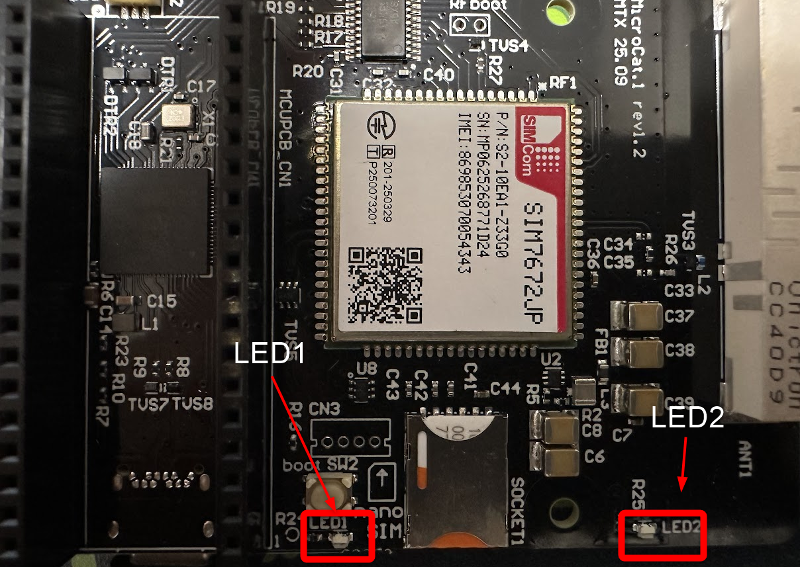

# 2: LチカでMicroCat.1の動作とMicroPythonでの制御方法を理解する

この章では、最初の動作確認として LED を点滅させます。

## 想定時間

5 分

## この章のゴール

- Thonny から MicroCat.1 にコードを書き込む
- 最小コードで LEDを点滅(Lチカ)させ、MicroCat.1を内蔵のMicro Pythonで制御できることを確認する

## 手順

MicroCat.1に内蔵されたLEDを、pythonから点滅させてみましょう。
MicroCat.1には、2つのLEDが搭載されています。



以下のソースコードを貼り付け、実行してみましょう。

```python
from machine import Pin
from time import sleep

led = Pin("LED", Pin.OUT)

while True:
    led.on()
    sleep(0.25)
    led.off()
    sleep(0.75)
```

LED1が0.25秒点灯し、0.75秒消灯する動作を繰り返すはずです。

応用として、LED2を点滅させてみましょう。4行目の`"LED"`を`"LED2"`に変更してみてください。LED2は、GPIO29に接続されていますので、`29`でも同様に点滅させることができます。

このように、Raspberry Pi Pico2と同様に、MicroPythonから`Pin()` 関数を使うことで、GPIOの操作が簡単に行えます。

---
- 次: [3: SIM の開通と SORACOM Harvest Data の設定](../chapter3/README.md)
- 前: [1: 環境構築 (Thonny インストール)](../chapter1/README.md)
