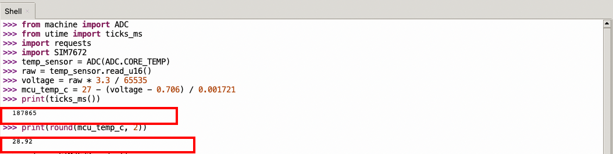
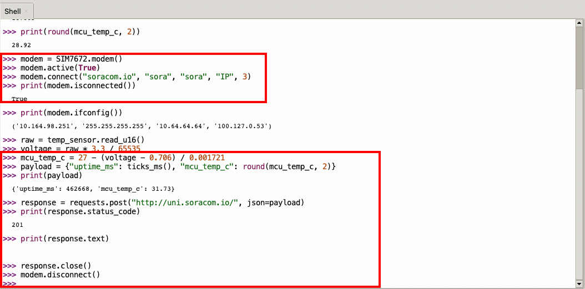
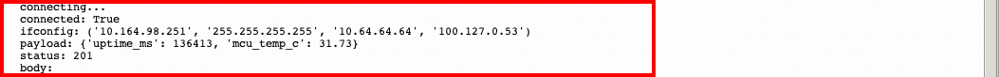

# 4: SORACOM へデータ送信して Harvest で確認

この章では、microcat1 から SORACOM へデータを送信し、Harvest で受信結果を確認します。

## 想定時間

10 分

## この章のゴール

- microcat1 からセルラー通信でデータを送る
- Harvest Data 上で受信したデータを確認する
- 送信内容と表示内容の対応を理解する

## 事前に確認すること

この章では、前の章で設定した SIM グループを使います。次の状態になっていることを確認してください。

- microcat1 に SIM が挿入されている
- SIM が所属するグループで SORACOM Harvest Data が ON になっている
- Thonny から microcat1 にプログラムを実行できる

## 送信するデータ

この章では、外付けセンサーの値ではなく、microcat1 の内部で取得できる値を送信します。

| 項目 | 内容 |
| --- | --- |
| `uptime_ms` | プログラム実行時点の起動後経過時間です。 |
| `mcu_temp_c` | microcat1 の MCU 内蔵温度センサーから取得した温度の概算値です。 |

`uptime_ms` と `mcu_temp_c` は、どちらも外付けセンサーを使わずに microcat1 の内部で取得できる値です。

## REPL で 1 つずつ確認する

まずは Thonny の REPL で、各コードブロックの内容を上から 1 行ずつ入力します。どこまで成功しているか確認しながら進めます。

### ライブラリを読み込む

```python
from machine import ADC
from utime import ticks_ms
import requests
import SIM7672
```

エラーが表示されなければ次に進みます。

### 内部データを取得する

```python
temp_sensor = ADC(ADC.CORE_TEMP)
raw = temp_sensor.read_u16()
voltage = raw * 3.3 / 65535
mcu_temp_c = 27 - (voltage - 0.706) / 0.001721
print(ticks_ms())
print(round(mcu_temp_c, 2))
```

どちらも数値が表示されれば、内部データを取得できています。

microcat1 では、MCU 内蔵温度センサーの ADC 入力を `ADC(ADC.CORE_TEMP)` で指定します。MicroCat.1 は RP2350B のため、古い Pico/RP2040 向けの例で見かける `ADC(4)` は使いません。



### セルラー接続する

```python
modem = SIM7672.modem()
modem.active(True)
modem.connect("soracom.io", "sora", "sora", "IP", 3)
```

接続状態を確認します。

```python
print(modem.isconnected())
```

`False` が表示された場合は、数秒待ってから同じ行をもう一度実行します。`True` が表示されたら IP アドレスなどを確認します。

```python
print(modem.ifconfig())
```

`print(modem.isconnected())` で `True`、`print(modem.ifconfig())` で IP アドレスなどが表示されれば、セルラー通信の準備ができています。

### Harvest Data に送信する

送信するデータを作ります。

```python
raw = temp_sensor.read_u16()
voltage = raw * 3.3 / 65535
mcu_temp_c = 27 - (voltage - 0.706) / 0.001721
payload = {"uptime_ms": ticks_ms(), "mcu_temp_c": round(mcu_temp_c, 2)}
print(payload)
```

Unified Endpoint に送信します。

```python
response = requests.post("http://uni.soracom.io/", json=payload)
print(response.status_code)
print(response.text)
response.close()
```

`201` が表示されれば、SORACOM Harvest Data にデータが保存されています。`response.text` が空でも問題ありません。

最後に接続を終了します。

```python
modem.disconnect()
```



## コードとして保存する

REPL で確認できたら、同じ処理を 1 つのコードとして保存します。

Thonny で新しいファイルを作成し、次のコードを貼り付けます。その後、microcat1 に `main.py` としてアップロードして実行します。

```python
from machine import ADC
from utime import sleep, ticks_diff, ticks_ms
import requests
import SIM7672


temp_sensor = ADC(ADC.CORE_TEMP)


def read_mcu_temperature_c():
    raw = temp_sensor.read_u16()
    voltage = raw * 3.3 / 65535
    return 27 - (voltage - 0.706) / 0.001721


modem = SIM7672.modem()
modem.active(True)
modem.connect("soracom.io", "sora", "sora", "IP", 3)

try:
    started_at = ticks_ms()
    while not modem.isconnected():
        if ticks_diff(ticks_ms(), started_at) > 60000:
            raise RuntimeError("modem connection timeout")
        print("connecting...")
        sleep(1)

    print("connected:", modem.isconnected())
    print("ifconfig:", modem.ifconfig())

    payload = {
        "uptime_ms": ticks_ms(),
        "mcu_temp_c": round(read_mcu_temperature_c(), 2),
    }
    print("payload:", payload)

    response = requests.post("http://uni.soracom.io/", json=payload)
    print("status:", response.status_code)
    print("body:", response.text)
    response.close()
finally:
    modem.disconnect()
```

## 実行結果を確認する

実行ログで次の点を確認します。

- `connected: True` が表示される
- `ifconfig:` に IP アドレスなどが表示される
- `payload:` に `uptime_ms` と `mcu_temp_c` が表示される
- `status: 201` が表示される

`status: 201` が表示されれば、SORACOM Harvest Data にデータが保存されています。`body:` の後ろが空でも問題ありません。

実行ログの例です。

```text
connected: True
ifconfig: ('10.164.98.251', '255.255.255.255', '10.64.64.64', '100.127.0.53')
payload: {'uptime_ms': 123456, 'mcu_temp_c': 31.73}
status: 201
body:
```



## Harvest Data で確認する

SORACOM ユーザーコンソールで Harvest Data を開き、対象の SIM を選択します。

データの一覧に、送信した `uptime_ms` と `mcu_temp_c` が表示されていれば成功です。

## FAQ

### `status: 201` が表示されない

SIM が所属するグループで SORACOM Harvest Data が ON になっているか確認してください。あわせて、SIM の状態、アンテナの接続、電波状況も確認します。

### `connected: False` になる

セルラー接続が完了していない状態です。数十秒待ってから再実行してください。改善しない場合は、SIM の挿入状態とアンテナの接続を確認します。

### Thonny の接続が切れた

Thonny のメニューから `Run` -> `Stop/Restart backend` を選択して、microcat1 に再接続します。Shell に `>>>` が表示されれば再開できます。

### Harvest Data にデータが表示されない

対象の SIM を選んでいるか確認してください。表示されない場合は、画面を再読み込みしてからもう一度確認します。

## 参考

- [MicroCat.1(MECHATRAX)をSORACOMに接続する（基本編）](https://zenn.dev/takao2704/articles/mechatrax-microcat1-basic)

---
- 次: [5: 追加コンテンツ - センサーをつないでみる](../chapter5/README.md)
- 前: [3: SIM の開通と SORACOM Harvest Data の設定](../chapter3/README.md)
